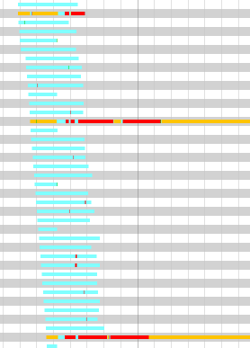

# connector-aurora-fail-test
Small code example to display a failover on amazon Aurora using MariaDb java connector.
Details explainations are on [mariadb documentation](https://github.com/MariaDB/mariadb-connector-j/blob/master/documentation/Failover_loop.md) 

